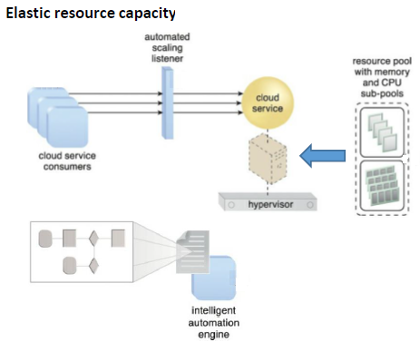

The next cornerstone* of Network Intelligence is 

an important quality or feature on which a particular thing depends or is based. 
 

# Data centers and automating cloud & network service provisioning

## Table of Contents

## Chapter 1: Cloud Services & Models

NIST - National Institute of Standards and Technology

Całość jest tu[[1] Peter Mell , Timothy Grance , The NIST Definition of Cloud Computing , Special Publication 800 145, 2011.](https://nvlpubs.nist.gov/nistpubs/legacy/sp/nistspecialpublication800-145.pdf)

### 1.1 Cloud definition in short

"**Cloud computing** is a model for enabling ubiquitous, convenient, on
demand network access to a shared pool of configurable computing
resources (e.g., networks , servers, storage, applications, and services)
that can be rapidly provisioned and released with minimal management
effort or service provider interaction. This cloud model is composed of five
essential characteristics, three service models, and four deployment
models."

ubiquitous - wszechobecny 
 

Czyli co to jest ta chmura?

Jest Service Provider no i on ma chmurę, czyli computing resources. Za pomocą Sieci (najczęściej Internetu) daje on dostęp do tych zasobów. Dostęp ten ma być wszechobecny, wygodny i on demand. Czym są te zasoby?

- networks - kilka "komputerów" połącznych siecią
- servers - komputer, na którym można wdrożyć apke
- storage - można przechowywać dane
- applications - można korzystać z gotowej apki, zamiast wdrażać swoją
- services - stoi apka coś obliczająca i Twoja korzysta z niej jak z serwisu

Zasoby te są współdzielone między wielu klientów, a ich provisioning (przypisane, że w tej chwili ten klient ma takie zasoby) powinny dziać się jak najbliżej do automatycznie. 

***

Następne rozdziały omówią:

- five essential characteristics

-  three service models
- four deployment models

### 1.2 Five essential characteristics

#### 1.2.1 On demand self-service

> start/stop service at any time

start/stop the service at any time , through automated interface , as convinient for the user as possible

#### 1.2.2 Broad Network Access

> Dostępne z internetu

access over the network, using heterogeneous client platforms (e.g., mobile phones, tablets, laptops, and workstations)

#### 1.2.3 Resource pooling

> Service Provider grupuje zasoby dla userów dając im wrażenie, że mogą oni sobie ich wziąć nieskończoność

- pooling (combining/grouping ) of physical virtual resources for ease of management to suport multi tenancy and the sense of infinite resources
- with a sense of location independence , although higher levels of abstraction are possible (region, country, zone ,
- with necessary precautions risk management activities taken by the users because of privacy and security concerns of resource sharing in the cloud

#### 1.2.4 Rapid Elasticity

> Bierzesz ile Ci potrzeba, skalujesz w realtime ile trzeba

- get as much resources as just needed
- scale up or down cloud resources as required automatically and in real time (or near real time)

#### 1.2.5 Measured Service

> Zużycie jest mirzeone ile klient płaci tyle ile zużył

- resource usage is monitored, controlled, and reported in a transparen t way for both the provider and consumer of the utilized service
- to optimize the utilization of cloud resources and introduce the pay as you go service model

### 1.3 Three Service Models

#### 1.3.1 Software as a Service

**NIST definition**

"The capability provided to the consumer is to use the provider’s applications running on a *cloud infrastructure** . The applications are accessible from various client devices through either a thin client interface, such as a web browser (e.g., web-based email), or a program interface. The consumer does not manage or control the underlying cloud infrastructure including network, servers, operating systems, storage, or even individual application capabilities, with the possible exception of limited userspecific application configuration settings.

*A **cloud infrastructure** is the collection of hardware and software that enables the five essential characteristics of cloud computing."

**Examples of SaaS offers**

Google Apps , Google Workspace, Dropbox, Cisco WebEx, GoToMeeting , MS Teams , WordPress Hosting

Zauważ, że cały Outlook/Teams w PLK jest w chmurze, przecież masz do niego dostęp z domu bez VPN, lokalnie nie jest nic trzymane w corp.plus.net to nie jest instancja Teams na naszym serwerze. To jest instancja Teams dla PLK na chmurze Azure.

**SaaS Advantages**

- reducing the time and money spent on tedious tasks such as installing, managing, and upgrading software
- IT is released from the day to day activities of running a data center, IT operations, and maintenance
- technical staff can be dedicated to more pressing matters and issues

**Saas Limitations**

- Interopretability - aplikacje dostajesz jaka jest i tyle. Więc mogą być problemy z zintegrowaniem jej z Twoimi innymi apkami. Tym bardziej if the SaaS app is not designed to follow open standards for integration. Dopiszesz sobie tylko i wyłącznie taki plug-in do Teamsów na ile Ci jego API pozwoli. A najchętniej to Ci sprzedadzą jakiś swój produkt do Twojego problemu, niż pozwolą plugin robić.

- Vendor Lock-In - the data may not be portable technically or cost effectively across SaaS apps from other vendors. Całą bazę kont z Teamsów ciężko przenieść na Google Meets nagle

- Lack of integration support - Often a deep integration with on premise apps, data, and services is required . The SaaS vendor may offer limited support in this regard

- Data Security - wiadomo, chmura publiczna to jest zawsze jakiś security threat

- Lack of Control - oddanie kontroli do 3-rd party wymusza to redefine data security and governance models. W Teamsach i tak nie trzymasz jakiś mega tajnych danych, więc jest git. Gorzej jakaś Twoja apka do retencji np.

- Customization - najmniejszy stopień customizacji. No weź w Teams coś skustomizuj xd

- Feature Limiations - dostajesz taką apke jaka jest. 

- Performance and Downtime - jesteś zależny od vendora pod tym względem. Cyberataki na jego cloud infra, network issues itp. mogą popsuć Twój biznes

**When to use SaaS**

- startups or small companies that need to launch ecommerce quickly , and do not want to deal with server issues or software
- short term projects that need quick, easy, and affordable collaboration tools
- app s that aren’t needed too often, such as tax software
- app s that need both web and mobile access

#### 1.3.2 Platform as a Service

**NIST definition**

"The capability provided to the consumer is to deploy onto the cloud infrastructure consumer-created or acquired applications created using programming languages, libraries, services, and tools supported by the provider. The consumer does not manage or control the underlying cloud infrastructure including network, servers, operating systems, or storage, but has control over the deployed applications and possibly configuration settings for the application-hosting environment."

**Example of PaaS offers**

[GoogleApp Engine](https://cloud.google.com/appengine) app s in Python, Java, and its derivatives, Go and PHP run over a scalable, elastic infrastructure, [AWS Elastic Beanstalk](https://aws.amazon.com/elasticbeanstalk/) app s in Java, .NET, PHP, Node.js, Python, Ruby, Go, Docker on Apache, Nginx, Passenger, IIS, [Microsoft Azure](https://azure.microsoft.com/en-us) apps in .NET, Java, PHP, Node.js, Python , and Ruby , integrated with Media Services, Service Bus, Notification Hubs , Scheduler , Automation, Visual Studio Online, Active Directory, and many more, [Heroku](https://www.heroku.com) apps in Node.js , Ruby , Java , P HP , P ython , Go , Scala , Clojure , intergrated with Github , CI/CD, containers , Postgres , Redis , app metric monitoring tools, [OpenShift](https://www.redhat.com/en/technologies/cloud-computing/openshift) (Red Hat K8s enterprise platform)

**PaaS Advantages**

- simple, cost-effective deveopment and deployment of apps
- scalable, highly available
- developers can customize apps without needing to maintain the software environment
- easy migration to hybrid cloud model

**PaaS Limitations**

- Data security - same as in SaaS
- Integration - you control the app, but still not every component of legacy IT systems is build for the cloud
- Cusotmization of legacy systems - PaaS is not a plug-in-and-play solution for existing legacy apps. The resulting cusotmization can result in a complex IT system that may limit the value of the PaaS investement altogether
- Vendor lock-in - Switching to alternative PaaS option may not be possible without affecting the business
- Runtime issues -  PaaS solutions may not be optimized for the language and frameworks of your choice. Specific framework versions may not be available or perform optimally with the PaaS service.
- Operational limitation - Already customized (i.e., using IaaS or private cloud ) cloud operations with management automation workflows may not apply to PaaS solutions, as PaaS platforms tend to limit operational capabilities for end users. Legacy capabilities may not be supported by a given PaaS.

**When to use PaaS**

- creation of customized applications while avoiding all of the infra and platform maintenance issues
- to streamline workflows when multiple developers are working on the same development project
- if other SW vendors must be included, PaaS can provide great speed and flexibility to the entire process

#### 1.3.3 Infrastructure as a Service

**NIST definition**

"The capability provided to the consumer is to provision processing, storage, networks, and other fundamental computing resources where the consumer is able to deploy and run arbitrary software, which can include operating systems and applications. The consumer does not manage or control the underlying cloud infrastructure but has control over operating systems, storage, and deployed applications; and possibly limited control of select networking components (e.g., host firewalls)."

**Examples**

[Amazon Web Services](https://aws.amazon.com), [Google Compute Engine](https://cloud.google.com/compute), [Microsoft Azure](https://azure.microsoft.com/en-us), [DigitalOcean](https://www.digitalocean.com), [Linode](https://www.linode.com), [Rackspace](https://www.rackspace.com) (co-founder of OpenStack), [Cisco Metacloud](https://www.cisco.com/c/en/us/solutions/cloud/index.html)

**IaaS advantages**

- most flexible model, the only one possible for LEGACY APPS
- easy to automate deployment of strorage, networking, servers and processing power
- hardware purchases can be based on consumption , utilization can be optimized
- clients retain complete control of their infrastructure
- cloud resources can be purchased as needed

**IaaS limitations**

- Security - same as SaaS and PaaS
- Multi-tenant Security - IaaS vendor is required to ensure that new customers cannot access data deposited to storage assets by previous customers. Customers must rely on the vendor to ensure that VMs are adequately isolated within the multitenant cloud architecture.
- Legacy systems operating in the cloud - każdy przypadek jest indywidualny. The cloud infrastructure may not deliver specific controls to secure the legacy apps. Enhancement to legacy apps required before migrating them to the cloud can lead to new issues .
- Internal resources and training -  Customers will be responsible for data security, backup, and business continuity. M onitoring and management of virtual resources may be difficult without adequate training of personel and resources available inhouse.

**When to use IaaS**

- startups and small companies to avoid expenses on purchasing and creating hardware and software
- larger companies to retain complete control over their applications and infrastructure, but to purchase only what they actually need
- companies experiencing rapid growth, to be able to replace specific hardware and software easily as their needs evolve
- when application’s demands are uncertain , IaaS offers plenty of flexibility and scalability

### 1.4 Four deployment models

#### 1.4.1 Public Cloud

**NIST definition**

The cloud infrastructure is provisioned for open use by the general public. It may be owned, managed, and operated by a business, academic, or government organization, or some combination of them. It exists on the premises of the cloud provider.

**Characteristic: public cloud service**

- is multi-tenant and the underlying resources are shared among multiple customers
- the public cloud provider owns and controls the security and protection of data between one customer and another customer

**Examples**

Gmail, Intuit, App Engine, Azure, Amazon Web Services, Rackspace, CenturyLink are all examples of public cloud providers.

Gmail np. to jest Public Cloud w modelu SaaS

Google App Engine to Public Cloud w modelu PaaS

#### 1.4.2 Private Cloud

**NIST definition**

"The cloud infrastructure is provisioned for exclusive use by a single organization comprising multiple consumers (e.g., business units). It may be owned, managed, and operated by the organization, a third party, or some combination of them, and it may exist on or off premises."

Czyli to jest taka chmura, którą np. my byśmy dawali jako PLK dla klientów 5G Campus.

**Characteristic: private cloud deployment**

- no sharing of resources outside of the corporate entity
- security and data protection is owned by the same business entity.

**Examples**

OpenStack (Rackspace , VMware , Red Hat , HP, IBM, EMC, and Oracle)
Cloud Suite (VMware)

#### 1.4.3 Community Cloud

**NIST definition**

"The cloud infrastructure is provisioned for exclusive use by a specific community of consumers from organizations that have shared concerns (e.g., mission, security requirements, policy, and compliance considerations). It may be owned, managed, and operated by one or more of the organizations in the community, a third party, or some combination of them, and it may exist on or off premises."

**Characteristic: Community cloud deployment**

- is effective for consortium groups and special interest user groups
- security and data access between members of a consortium or user group is permitted

- outside of the consortium or user group, access is restricted

**Examples of such deployments**

Facebook, LinkedIn, Twitter

#### 1.4.4 Hybrid Cloud

**NIST definition**

"The cloud infrastructure is a composition of two or more distinct cloud infrastructures (private, community, or public) that remain unique entities, but are bound together by standardized or proprietary technology that enables data and application portability (e.g., cloud bursting for load balancing between clouds). "

**Characteristic terms**

- **cloud bursting**, which means going from private cloud to public cloud
- backup and disaster recovery, also going from private cloud to public cloud

**Example of hybrid cloud offers**

[AWS VPC](https://docs.aws.amazon.com/vpc/latest/userguide/what-is-amazon-vpc.html), [Intervision/Bluelock](https://intervision.com/cloud-services/)

### 1.5 Summary

Other "as a Service" offerings

- [AI as a service](https://www.bmc.com/blogs/ai-as-a-service-aiaas/)
  - [Google Vertex AI](https://cloud.google.com/vertex-ai)
- [DBaaS](https://www.bmc.com/blogs/dbaas-database-as-a-service/)
- [BPMaaS](https://www.bmc.com/blogs/bpmaas-business-product-management-as-a-service/)
- [FaaS](https://www.bmc.com/blogs/faas-function-as-a-service/)
- [TaaS](https://www.bmc.com/blogs/taas-testing-as-a-service/)

## Chapter 2: IaaS platforms
ToC

1. Overview
2. Cloud usage architectures
3. VIM
4. Example of VIM

### 2.1 Overview

**Cloud provider** offers a product for the **cloud consumer**.  The product can vary, from:

- a single VM to
- rich **user stacks**

There are various facilities* available for consumers to create and manage their **IaaS user stacks**.

* an ability to do or learn something well and easily; a natural aptitude.  
    obiekt to drugie znaczenie

 

> Jako IaaS consumer dostajesz infra, na której możesz coś odpalić. Ale to prosisz o odpalenie tego gościa tam, no bo jak inaczej on ma Ci to dać xd

> Np. PLK - **cloud consumer**, zamawia w Azure - **cloud provider**, serwer o podanych wyżej specs/SLA. Odpalamy na nim swoją jakąś apkę np. IMS i **service user**, to pani Kasia, która dzwoni VoLTE.

#### 2.1.1 User Stack

> Możesz mieć single VM, a możesz je dodatkowo połączyć w sieć, mieć firewall itp. itd

### 2.2 Cloud usage architectures

> Mamy tu na myśli zarówno:
>
> - usage przez **service user** jak i 
> - przez **cloud consumer**

The goal of the Cloud Usage Architectures is to identify common patterns and characteristics, but  remember - these are not "concrete" systems 

Each architecture:

- addresses a specific higher-level objective/goal
- combines adequate cloud **lower-level mechanisms** and uses them to meet the architecture objective/goal

**Resource cluster** - is a collection of elements used to serve a larger number of concurrent clients (scalability) and/or avoid a single point of failure (failover, redundancy).

#### 2.2.0 Requirements that drive IaaS mechanisms&architectures

Top level requirements result from cloud service characteristics

- on-demand self-service
- broad network access
- resource pooling
- rapid elasticity
- measured service

But with respect to IaaS specific contribution

- providers provision fundamental cloud computing resources as processing , storage , networks
- consumers can deploy and run arbitrary OS es, SW and apps
  - do not manage or control the underlying cloud infrastructure but have control over OS'es , storage, deployed apps, and over **created stacks**

#### 2.2.1 Workload Distribtion Architecture

**Goal**

- horizontal scaling for performance, static by itself

**Applicable for**

- service (np. FaceBook), virtual servers and disks, virtual switches, virtual routers, etc.

**Used mechanisms**

- load balancer, audit/usage monitor, hypervisor, resource cluster

#### 2.2.2 Resource Pooling Architecture

**Resource pool** - is used to avoid constantly creating/destroying resources which creation/provsioning is costly. Pools can be
treated as pre-reserved groups of resources dedidated to sub-groups of tenants/services, etc. 

> Czyli jest już jakaś poola odpalonych resourceów i z niej można brać

**Goal**

- responsiveness in resource provisioning

**Applicable for**

- physical/virtual servers/CPU/RAM/storage/network elements (firewalls/switches/routers)

**Used mechanisms**

- audit/usage monitor, hypervisor, pay-per-use monitor, resource replication, resource management, etc.

#### 2.2.3 Dynamic Scalability Architecture

**Goal**

- automated allocation of resources from pools

**Types**

- horizontal/vertical scaling, reallocation

**Applicable for**

- servers, memory, storage, network 

- > cloud service na rysunku to jest z tych własnie

**Used mechanisms**

- automatic scaling listener, resource replication, cloud usage monitor, pay-peruse monitor

#### 2.2.4 Elastic Resource Capacity Architecture

**Goal**

- dynamic allocation/reclaim of CPUs and RAM for VMs in immediate response to the fluctuating processing requirements

**Applicable for**

- CPU, RAM (not storage and network)

**Used mechanisms**

- automatic scaling listener, resource replication, cloud usage monitor, pay-peruse monitor

#### 2.2.5 Other note-worthy architectures

##### 2.2.5.1 Service Load Balancing Architecture

specialized version of workload distribution dedicated to cloud service implmentations (protocol sensitive, etc.)

##### 2.2.5.2 Cloud Bursting Architecture

Goal: dynamic scaling on premise IT resources into a cloud whenever predefined capacity thresholds have been reached

> a configuration method that uses cloud computing resources whenever on-premises infrastructure reaches peak capacity

##### 2.2.5.3 Elastic Disk Provisioning Architecture

Goal: dynamic storage provisioning system that ensures that the cloud consumer is granularly billed for the exact amount of storage that it actually uses

Used mechanisms : cloud storage device, hypervisor, pay per use monitor , c loud u sage m onitor , resource replication virtual server (virtual servers have thin-provisioning software installed)

##### 2.2.5.4 Redundant Storage Architecture

Goal: provide storage failover system that synchronizes its data with the data in the primary cloud storage device

### 2.3 VIM - Virtual Infrastructure Manager

#### 2.3.1 Top-level view of a cloud system

> Zbudował ktoś data center, ale jak teraz dawać tym klientom usługi i robić to wszystko, tyle kompów i to musi wszystko obejmować jeden system ja jebix jak za to się wgl zabrać.

This view attemps to be "vendor agnostic", but vendor views are typically somewhatspecific and thus can differ from each other

#### 2.3.1.1 Remote admin system

>  System zdalnego admina: admin w sensie klient (adminuje on swoje resource) albo god mode (adminuje on całe data center).

- Self-service portal
  - more like a shopping portal for the clients
- usage and administration portal
  - access to virtually all features of the cloud

#### 2.3.1.2 Resource Management System (aka VIM - Virtual Infrastructure Manager)

Discussed later

#### 2.3.1.3 SLA management system

not discussed here

#### 2.3.1.4 Billing management system

not discussed here

### 2.3.2 Different flavors of VIM

There are 3 types of VIM when it comes to the scope of managing. Everything is depicted below:

One of the VIMs is The OpenStack.

### 2.4 OpenStack

#### 2.4.1 Intro

> Był sobie ten data centrowy hardware, a OpenStack dodaje na to level abstrakcji i pozwala Ci tworzyć resource'y compute (CPU&RAM), networking i storage. A tam pod spodem sam sobie manageuje ten istniejący hardware, żeby Tobie to zapewnić.

#### 2.4.2 How is OpenStack architected?

FIRST, OpenStack is NOT a large monolithic piece of software!!!

OpenStack is a collection of Projects, which are known as **Services**

Each of them is responsible for automating some part of the infrastructure

Each project exposes a REST API

https://docs.openstack.org/api-quick-start/ 

#### 2.4.3 Core projects

These image present some subset/selection of projects

https://www.openstack.org/software/project-navigator/openstack-components#openstack-services 

#### 2.4.4 Main components

**SSO - Single Sign-On** - an authentication method that enables users to securely authenticate with multiple applications and websites by using just one set of credentials

> Dobra no to mamy tak. Podstawowy imo resource to jest **Compute**, czyli maszyny wirtualne. To na nich odpalamy swoje apki (pamiętaj, że jesteśmy w IaaS). Jak chcemy odpalić więcej tych maszyn np. mieć firewall, albo external db, to wtedy dopiero imo potrzebujemy **Network**. No i też fajnie jak te maszyny wirtualne mogą coś zapisać na dysk, czyli potrzebujemy volume i od tego jest **Block storage**. Obrazy maszyn wirtualnych został wrzucone do jednego wora co obrazy Dockerowe no i ogólnie trzymane one są w komponencie **Image**. Co to jest **Object Storage** to jeszcze nie wiem. Może Image to tylko DOCKERFILE, a to co się dockerfile::COPY zrobić to jest w Object Storage?

#### 2.4.5 Architecture

Each component offers its REST API, so we can work with it threeway:

- CLI client (co za problem napisać CLI, które wywołuje te REST API)
- GUI tools (co za problem napisać htmlka, który wywołuje te REST API)
- Python API (co za problem napisać API do REST API w pythonie)

With OpenStack then we can work with:

- Horizon (the GUI tool)
- REST API
- OpenStack CLI

**Projects/Services**

- are complementary, each is responsible for a specific task
- authenticate each other via Identity Service (Keystone)
- communicate internally using AMQP message broker (e.g. RabbitMQ)
- communicate externally (between other services) via HTTP REST API

> The **Advanced Message Queuing Protocol** (**AMQP**) is an [open standard](https://en.wikipedia.org/wiki/Open_standard) [application layer](https://en.wikipedia.org/wiki/Application_layer) protocol for [message-oriented middleware](https://en.wikipedia.org/wiki/Message-oriented_middleware). The defining features of AMQP are message orientation, queuing, [routing](https://en.wikipedia.org/wiki/Routing) (including [point-to-point](https://en.wikipedia.org/wiki/Point-to-point_(telecommunications)) and [publish-and-subscribe](https://en.wikipedia.org/wiki/Publish–subscribe)), reliability and security
>
> **RabbitMQ** is an open-source [message-broker](https://en.wikipedia.org/wiki/Message_broker) software (sometimes called [message-oriented middleware](https://en.wikipedia.org/wiki/Message-oriented_middleware)) that originally implemented the [Advanced Message Queuing Protocol](https://en.wikipedia.org/wiki/Advanced_Message_Queuing_Protocol) (AMQP) and has since been extended with a [plug-in architecture](https://en.wikipedia.org/wiki/Plug-in_(computing)) to support [Streaming Text Oriented Messaging Protocol](https://en.wikipedia.org/wiki/Streaming_Text_Oriented_Messaging_Protocol) (STOMP), [MQ Telemetry Transport](https://en.wikipedia.org/wiki/MQ_Telemetry_Transport) (MQTT), and other protocols

#### 2.4.6 User Stack

**User stack** is the "product" of the IaaS service provided to cloud consumer by OpenStack. User stacks can be created/destroyed/managed in order to run cloud services on them.

**Networking** is the key component in stack creation. Other concepts are: VM, storage, container orchestration service,...

#### 2.4.7 OpenStack Networking

##### 2.4.7.1 Good to know

- NIC, MAC

- LAN, VLAN, VXLAN
- Connecting two LANs (through VLAN (switch należy do dwóch VLANów) or using L3 routing)
- IP address, CIDR
- DHCP, ARP, DNS

> Każdy NIC ma adres MAC
>
> LAN - group of NIC that share a common communication links
>
> VLAN - technologia , która pozwala w ramach jednej fizycznej sieci lokalnej tworzyć wiele sieci logicznych (sieci wirtualnych)
>
> VXLAN -  an encapsulation protocol that provides data center connectivity using tunneling to stretch Layer 2 connections over an underlying Layer 3 network
>
> DHCP - a network management protocol used to dynamically assign an IP address to any device, or node, on a network 
>
>  ARP - is a [communication protocol](https://en.wikipedia.org/wiki/Communication_protocol) used for discovering the [link layer](https://en.wikipedia.org/wiki/Link_layer) address (MAC), associated with a given [internet layer](https://en.wikipedia.org/wiki/Internet_layer) address (IP)
>
> DNS - The Domain Name System is a hierarchical and distributed naming system for computers, services, and other resources in the Internet or other Internet Protocol networks.

##### 2.4.7.2 Neutron

User creates a stack. Usually the stack has several VMs, and user also request for the network to communicate these VMs. OpenStack (Neutron to be more specific) need to organize such network on the data center infrastructure in a transparent manner for user.

Such network is called **tenant network** or **self-service network**

So the role of Neutron is to **provide connectivity as of (A) on the data center infrastructure as of (B)**

> Tu na tym rysunku User chce mieć jakaś tam VMke, 3 .COM (compute coś tam?), switch który to wszystko łączy w jedną sieć oraz router na świat zewnętrzny, żeby można było dostać się do tej siećki z internetu.
>
> Jak widać Neutron zmapował to, że odpalił na Network Node (może to nawet serio jakiś router jest fizycznie) serwis o nazwie Forwarding as a Service, Load Balancing as a Service, i to coś robi jako switch, przy okazji odpalił też tam router L3 na rzecz tego tenant-network i pozwolił rutować do internetu oraz do dwóch compute Node. Compute Node to pewnie ficzynie jakieś racki, na dole jest L2 switch i są odpalone instancje VMek na nich i elo.

##### 2.4.7.3 Networking Concepts

###### 2.4.7.3.1 Provider Network

Created/updated only by admins because require configuration of physical network infrastructure.

Offers L2 connectivity with the scope of one **Rack Server**. Spans between NICs of routers (phy or vir) and/or (phy/vir) bridges of rack servers.

> **Rack Server** - to jedne o takie
>
> 

Provider Network maps onto L2 VLAN in the physical infra of Data Center. Either flat network (VLAN=1)  or tagged VLAN.

These networks are typically used as **external network**, because they can connect tenant-networks with the Internet

Provider networks are more like not in the Rack Server intra area, but on the aggregation switches level.

These network carry the L3 traffic to the Rack Servers, so one Rack can communicate with the other Rack or with the Internet.

The provider network maps to multiple L2 segmented*, which each of is essentially a provider network, each eth::segment has a router gateway attached to it (ToR switches?) which routes trafiic between eth::segments and externally, Rack Servers must reside in provider network ethernet segments

the Neutron Networking service does not provide the routing on L3, the admin configures L3 routing on her/his own

*Ethernet::Segment

###### 2.4.7.3.2 self-serive network (tenant/project network)

Entirely virtual - L2 broadcast domain

Reserved for the tenant who created it

Require virtual routers to access provider network and external network such as the Internet. This virtual router is called **tenant virtual L3 router** created per tenant-network by Neutron, network-external traffic travels through the tenant router

In most cases we user overlay protocols such as VXLAN or GRE to create tenant networks (it is possible to use VLAN but not in larger Data Centers)

Routing between:

- tenant network withing the same tenant (project) must be set manually in **tenant L3 routers**
- tenants - must be done using floating IP and provider network router

Tenant network enable manageing networks in non-priviledged project without involving DC admins

For IPv4 typically use private IP address ranges (RFC1918) and interact with provider networks via source NAT on virtual routers

- floating IP addresses enable access to instances from provider networks (and from the outside of DC) via destination NAT on virtual routers
- between tenants connectivity via external routers using floating IP addresses (as Internet traffic

For IPv6 always use public IP address ranges and interact with provider networks via virtual
routers with static routes.

Self service networks for external traffic must traverse a layer 3 agent (tenant L3 router).

###### 2.4.7.3.3 Subnet

A block of IP addresses and associated configuration state

- provided by the Networking Service (Neutron) for both tenant and provider networks
- used to allocate IP addresses to VM instances and when new ports are created on a network

> Czyli po prostu pule adresów sobie konfigurujesz jako user jaka ma być

###### 2.4.7.3.4 Port

A connection point on a virtual network for attaching a single device to this network 

- device is a NIC of a virtual server, router, gateway device

Also describes the associated network configuration

- Such as the MAC and IP addresses to be used on that port

###### 2.4.7.3.5 Security Group

> Security groups provide a container for virtual firewall rules that control ingress (inbound to instances) and egress (outbound from instances) network traffic at the **port** level. Security groups use a default deny policy and only contain rules that allow specific traffic. Each port can reference one or more security groups in an additive fashion. The firewall driver translates security group rules to a configuration for the underlying packet filtering technology such as `iptables`.
>
> Each project contains a `default` security group that allows all egress traffic and denies all ingress traffic.

Security groups are stateful which means - e.g. allowing ingress TCP port 22 for SSH automatically creates rules that allow return egress traffic and ICMP error messagees for involved TCP connections

ingress - przychodzący   egress - wychodzący 
 

**Separate ARP filtering**

Although non-IP traffic, security groups do not implicitly allow all ARP traffic. Separate ARP filtering rules prevent instances from using ARP to intercept traffic for another instance. You cannot disable or remove these rules.

**Default rules**

By default, all security groups contain a series of basic (sanity) and anti-spoofing rules that perform the following actions:

- Allow egress traffic only if it uses the source MAC and IP addresses of the port for the instance, source MAC and IP combination in `allowed-address-pairs`, or valid MAC address (port or `allowed-address-pairs`) and associated EUI64 link-local IPv6 address.
- Allow egress DHCP discovery and request messages that use the source MAC address of the port for the instance and the unspecified IPv4 address (0.0.0.0).
- Allow ingress DHCP and DHCPv6 responses from the DHCP server on the subnet so instances can acquire IP addresses.
- Deny egress DHCP and DHCPv6 responses to prevent instances from acting as DHCP(v6) servers.
- Allow ingress/egress ICMPv6 MLD, neighbor solicitation, and neighbor discovery messages so instances can discover neighbors and join multicast groups.
- Deny egress ICMPv6 router advertisements to prevent instances from acting as IPv6 routers and forwarding IPv6 traffic for other instances.
- Allow egress ICMPv6 MLD reports (v1 and v2) and neighbor solicitation messages that use the source MAC address of a particular instance and the unspecified IPv6 address (::). Duplicate address detection (DAD) relies on these messages.
- Allow egress non-IP traffic from the MAC address of the port for the instance and any additional MAC addresses in `allowed-address-pairs` on the port for the instance.

## Chapter 3: Automation & Orchestration

### 3.1 Service architecture evolution

### 3.2 Requirements for automation & orchestration

Providing service in this new Micorservices manner in a virtualized environment demands:

- **efficient deployment** capabilities for functions/services (speed is key)
- **dynamic management** capabilities for the deployed functions/services
- altogether its called the **Lifecycle Management (LCM)**

And the **Automation** of these processes is a common approach

So we have **Lifecycle Management (LCM) Automation**, it should cover physical/virtualized infra, service functions, and services (sets of service functions) at dfiferent stages of LCM (onboarding, deployment, operation, destroying)

### 3.3 Automation of operational tasks - how?

There are two (three) approaches

- **scripts**
  - used from early days
  - sequences of instructions to execute to achieve specific management goal
  - even today a key component of automated solutions
  - this approach is **imperative**
- **models**
  - more abstract solution
  - build a system once and orchestrate it "100" times
  - build templates/blueprints and the orchestrator will imperate alone to your desired state
  - this approach is **declarative**
- **intent-based**
  - The 3rd approach in the evolution

### 3.4 Imperative vs Declarative vs Intent-based

**Scripts - imperative approach**

Weakly scalable, hard to maintain (lots of details), highly trained personnel required, changes are time consuming, vendor specific (inny skryp na router Cisco inny na Adtran)

**Models - declarative approach**

model (WHAT ) description of the goal of the activity ,of what is desired desired state

Model provides the orchestrator with only necessary information on the WHAT and remains generic, so (ideally) model is independent from the runtime platform

This approach hold the allure of no coding ("programming" as in scripting)

Implementation is hidden from service designer by the orchestrator

Service designer focuses on "target"/"fnial product", not on "instructions"

**Summary**

>Imperative mówi orchiestratorowi JAK MA ZROBIĆ nasz serwis
>
>Declarative mówi orchiestratorowi JAK MA WYGLĄDAĆ nasz serwis, jak on do niego dojrze to już sobie sam wykmini
>
>Intent-Based mówi orchiestratorowi CO NASZ SERWIS MA UMIEĆ a on na tej podstawie wykminia jak ma wyglądać, i dochodzimy do punktu wyżej

### 3.5 Our context - large scale automation

At large scale we habe two general requirements to fulfill:

- Reliable monitoring
  - telemetry
  - data lakes, big data -> calls for the use of AI
- Programmability
  - isolation of low-level deails through intelligent models/templates
  - and software-like interfaces to the network

### 3.6 Types of declarative models

#### 3.6.1 Configuration&State models

**YAML**

Yet Another Markup Language

- model representation/data serialization

- modeling used to map items to native config
- in tools such as NAPALM (OpenFlow is imperative on it's level)

> NAPALM - (Network Automation and Programmability Abstraction Layer with Multivendor support) is a Python library that implements a set of functions to interact with different network device Operating Systems using a unified API. Supported Operating Systems: Arista EOS, Cisco IOS, Cisco IOS-XR, Cisco NX-OS, Juniper JunOS

**YANG**

Yet Another Next Generation

- used as data model along with NETCONF
- not widely supported yet
- to be effectively used management ools are needed
- operational complexity can be high

> NETCONF is a protocol defined by the IETF to “install, manipulate, and delete the configuration of network devices.

#### 3.6.2 Declarative orchestration models

**OpenStack HEAT/HOT**

- deploy elements of virtualized infra, used on OpenStack or AWS

**TOSCA**

- deployment of virtualized servies, 
- Topology and Orchestration Specification for Cloud Applications, OASIS

**Ansible playbooks**

- configure+ elements of phy/vir infra

**Kubernetes**

- container orchestration system for automating software deployment, scaling, and management.

**Intent-based for SDN networking** 

- Not approved standards so far

### 3.7 Three layer picture of NSO

NSO - Network Service Orchestration

**Automation Platform**

Combines workflow, scripting, and API aggregation to provide applications for operations automation (user-facing entry point)

**Orchestration**

Provides modeling/templating capabilities and communicates to Network via Interpreters

**Interpreter/programmability**

Translates models/templates to device-understood commands (SDN-SBI is her, among others)

### 3.8 Flavors of NSO

NIST, ETSI, IETF, ONF, 3GPP, MEF

- arrangement, coordination , and management of virtualized infrastructure
- set of coordinated processes that automate the management and control of information systems to reach a common goal
- selection and usage of resources by orchestrator for satisfying client demands according to the service level
- automated control and management of network resources
- automated service management across multiple operator networks that include fulfillment (provisioning / configurations), assurance (quality
  management), performance, usage, security, analytics, and policy capabilities

### 3.9 NSO generic functionality

**Service orchestration - mutlidomain**

- service composition and decomposition
- model-based interaction with other components such as Marketplace and OSS/BSS

**Resource orchestration - single domain**

- mapping service requests to resources, either vir/phy
- mapping occurs across elements such as NFVO, EMS, and SDN controllers

**Lifecycle orchestration - multi/single domain**

- managements of workflows/processes and dependencies across service components
- maintain the services running according to the contracted SLA

