# Teoria informacji

## Podstawowe definicje aksjomaty

**Źródło wiadomości** - element systemu generujący wiadomości. Definiowane jest przez:

- **X: {x0, x1, .... x(n-1)} ⊆ Ω ** - zmienna losowa
- rozkład p-stwa (gęstość) tej zmiennej losowej

**Wiadomość** - to ciąg symboli należących do **alfabetu**  **Ω**, generowany przez *źródło wiadomości*.

Przykłady alfabetów i ich *źródeł wiadomości*

- Ω = {czerwony, żółty, zielony} – światła uliczne 
- Ω = {a, b, …, z, A, B, …, Z} język angielski
- Ω = ASCII – źródło tekstowe, dowolny język alfabetyczny
- Ω = {0,1…,255} –  8-bitowy przetwornik A/D w kamerze/skanerze; piksele w obrazie dla jednej ze składowych
-  Ω = {-215, ...,+215} – źródło: 16-bitowy przetwornik A/D  w karcie dźwiękowej; próbki sygnału audio
-  Ω = (0, 5V] – źródło: analogowy czujnik; wartość napięcia

Przykłady wiadomości:

- [0, 20, 56, 128, 130 97 56] - gdzie alfabetem jest {0,1…,255}
- "Ala ma kota" - gdzie alfabetem jest ASCII

*Źródła wiadomości* dzielimy na **dyskretne** i **ciągłe**. Dyskretne charakteryzują się tym, że ich zmienna losowa ma dyskretny alfabet i dyskretny rozkład p-stwa. Ciągłe tym, że ich alfabet i gęstość p-stwa są ciągłe.

Przykłady:

- Dyskretne
  - język angielski, 8-bitowy przetwornik A/D
- Ciągłe
  - wartość napięcia na analogowym czujniku

*Źródła wiadomości* też dzielimy na **bez pamięciowe** i  **z pamięcią**

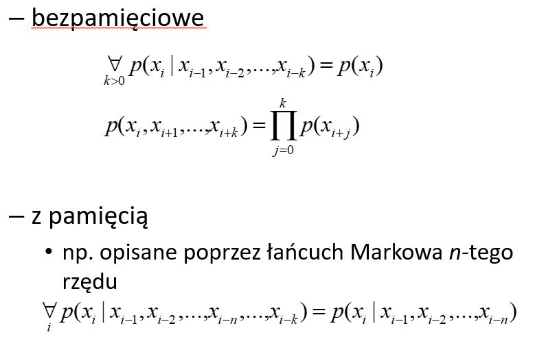

## Informacja

**Informacja** - cecha wartościująca wiadomość. Jest to właściwość wiadomości. Określa potencjalny wpływ na wiedzę odbiorcy. 

Informacja niesiona przez 2 niezależne *źródła wiadomości* powinna być sumą informacji niesionych przez składowe wiadomości.

Informacje oznaczamy poprzez `I(x)` gdzie `x` to wiadomość

> Która z wiadomości niesie najwięcej informacji? Jak to zmierzyć?
>
> x = "Jutro jest czwartek", Ω = ASCII
>
> x = "Jutro będzie padał deszcz", Ω = ASCII
>
> x = "Jutro satelita uderzy w PKiN", Ω = ASCII

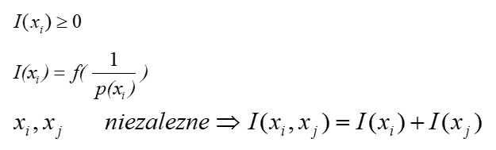

Stąd wynika wzór na Miarę informacji z danej wiadomości.

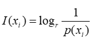

Gdzie:

```
I(xi) - miara informacji jaką niesie wiadomości `xi`
r - wartościowość kodu
p(xi) - prawdopodobieństwo wystąpienia wiadomości `xi`?
```

## Autoinformacja

Autoinformacja

W zależności od wartościowości kodu, czyli od podstawy logarymu we wzorze na `I(xi)` mówimy o róznych jednostkach informacji. 

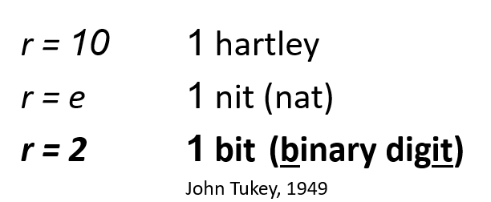

> One hartley is the information content of an event if the probability of that event occurring is 1⁄10.[[4\]](https://en.wikipedia.org/wiki/Hartley_(unit)#cite_note-IEC-4) It is therefore equal to the information contained in one [decimal digit](https://en.wikipedia.org/wiki/Decimal_digit) (or dit), assuming *[a priori](https://en.wikipedia.org/wiki/A_priori_probability)* equiprobability of each possible value.
>
> If [base 2 logarithms](https://en.wikipedia.org/wiki/Binary_logarithm) and powers of 2 are used instead, then the unit of information is the [bit](https://en.wikipedia.org/wiki/Bit), which is the information content of an event if the[probability of that event occurring is 1⁄2

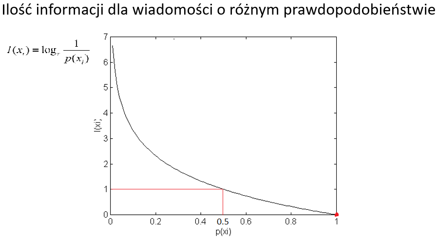

Zauważmy, że skoro mamy alfabet jednoelementowy. To p-stwo wystąpienie wiadomości złożonej z tego elementu wynosi 1. Taka wiadomość totalnie nic nam nie mówi. W systemie dzieje się ciągle to samo. Jak podstawisz do wzoru wydarzenie pewne, to wyjdzie log(1) czyli 0 (nieważne jaki log base). Punktem odniesienia są dla nas bity (na tym wykresie log_base=2). Więc ustalamy  Ω = {0,1}, wtedy `p(x=0) = 0.5 = p(x=1)`, podstawiamy do wzoru i wychodzi, że bit niesie `1` informacji. To jest punkt odniesienia, jak widać im bardziej nieprawdopodobne wiadomości się zadzieją tym więcej niosą informacji. Przykładowo, jeśli w języku angielskim musisz zgadnąć słowo i masz wiadomość, że jedna z jego liter to `e` (najczęściej występująca litera, 13% tekstów w ang. to `e`) to masz mało informacji na temat tego słowa. Jeśli zaś dostaniesz wiadomość, że jest tam litera `x` to już Ci da dużo informacji. Czyli ta informacja, to jest miara tego jak dużo stanów systemu możesz wykluczyć?

## Entropia

**Entropia** - średnia ilość informacji generowanej przez źródło.

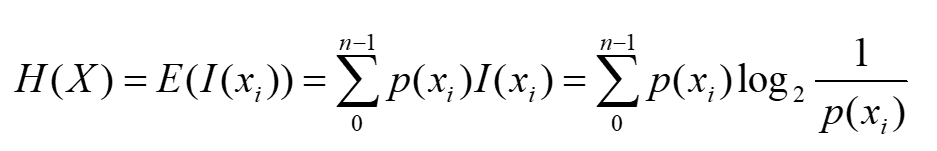

#### Przykład

Mam źródło binarne, i pstwo występowania tam `x0` wynosi `p`, więc pstwo występienia `x1` wynosi `1-p`.

Jaka jest entropia?

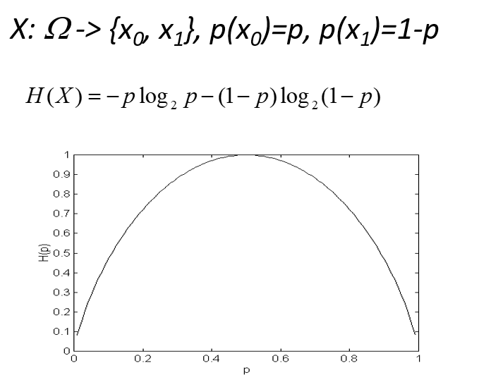

Co nam mówi ten wykres. Jeśli damy tak, że `p=0.01` czyli jeden symbol jest niemal zawsze drugi czasamiutko, no to wtedy Entropia, czyli średnia ilość informacji generowana przez źródło jest mała. Czyli mamy jakiś system, który emituje 0 i 1, ale 0 non-stop a 1 bardzo rzadko, to przez większość czasu mam cały czas 0 o stanie systemu nie wiemy zbyt dużo, może jakieś niżej poziomowe wartości są rzutowane do tego zera, a my o tym nie wiemy? 

Z kolei w drugą stronę, jak mamy p(x=0)=p(x=1)=0.5 to za każdym symbolem wiemy że system coś się zmieniło w nim lub nie. To jest największa możliwa entropia dla systemu, którego alfabet jest dwuwartościowy.

Dochodzimy więc do wniosku, że im p-stwa zajścia wiadomości są bliższe sobie, tym entropia systemu jest większa. Tak jak na fizyce, entropia to miara uporządkowania układu. Gdy mam p(x=0)=99%, a p(x=1)=1% no to taki układ (output tego) jest uporządkowany, widzimy ciągle zera. ale jak np. mamy alfabet 4 wartościowy i każda wiadomość ma p=0.25 to co chwila widzimy coś innego, coś nowego niz poprzednio czyli nieuporządkowanie jest duże.

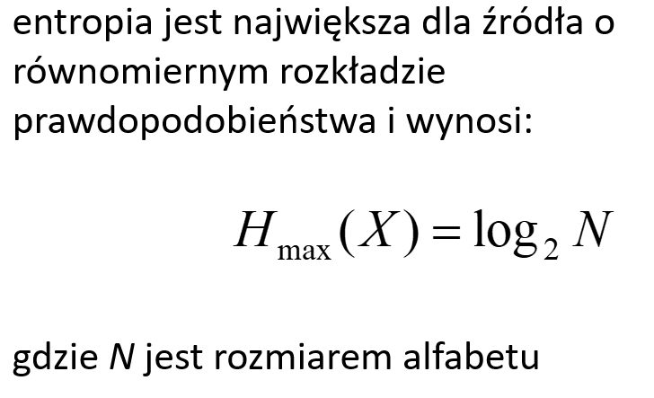

## Inne parametry źródła

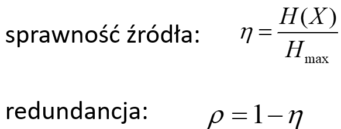

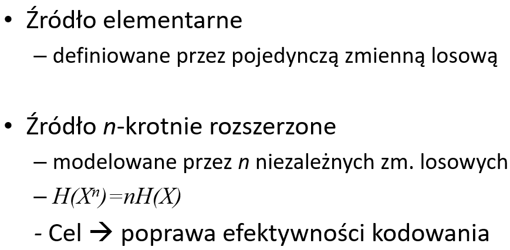

# Zadania 

## Ile wynosi autoinformacja jednego z 256 zdarzeń, które mają takie same p-stwo zajścia? Ile wynosi entropia tego źródła?

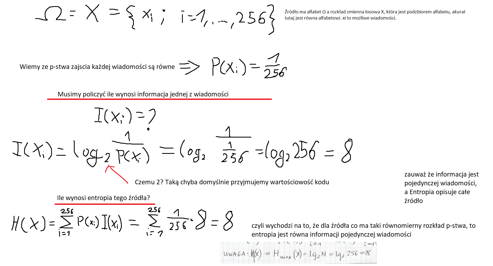

## Jaka powinna być podstawa logarytmu w definicji autoinformacji, aby równanie to można było uznać za definicję bajtu(bitu)?

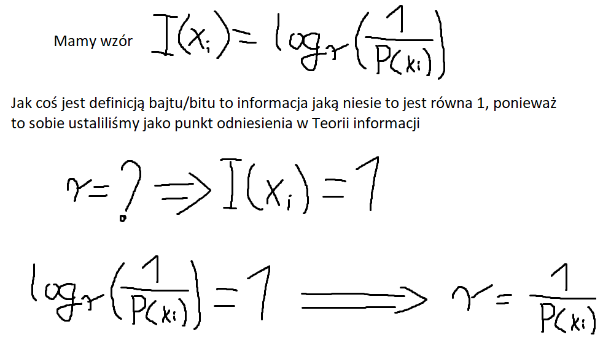

## Jaka jest ilość informacji w tablicy samochodowej używającej trzech liter oraz następujących po nich trzech cyfr?

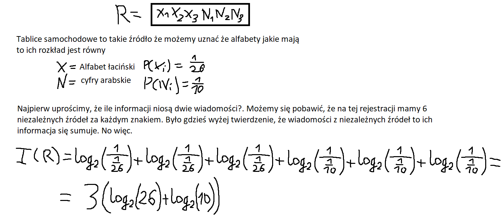

## Jaka jest ilość informacji zawarta w ciągu kart pochodzących ze standardowej taliii kart? Od czego zależy odpowiedź na to pytanie?


